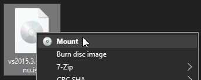
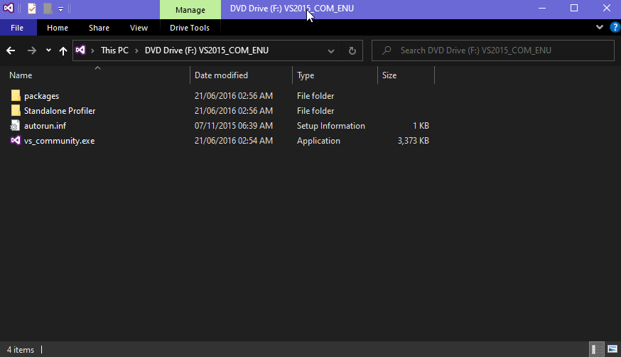
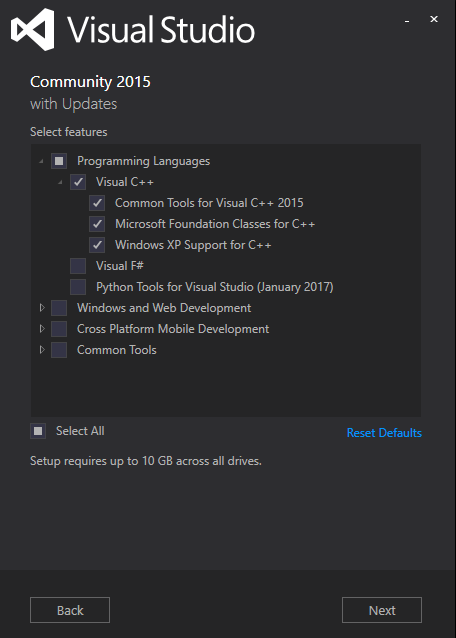

In *Setting up UE4*, we show you the process of compiling a custom version of Unreal Engine 4 in order to cook asset files that the game can use.
This process targets the Windows platform.

## Installing Visual Studio 2015
The Unreal Engine 4 version we are using is a custom version that is based of 4.13.2 but with TemplateIndexes from 4.14, requires Visual Studio 2015 to be installed otherwise Unreal Engine 4 can not open projects.

Download the [Visual Studio Community 2015 with Update 3 (7.19 GB)](http://download.microsoft.com/download/b/e/d/bedddfc4-55f4-4748-90a8-ffe38a40e89f/vs2015.3.com_enu.iso) ISO file.

Once downloaded, mount the ISO file by right clicking on it and pressing "Mount".



The ISO will be mounted as a DVD Drive on your computer, navigate to the virtual drive and open `vs_community.exe`.



The Visual Studio 2015 installation wizard will appear, make sure that the type of installation is set to `Custom`.


Make sure that anything under Visual C++ is selected, we don't need anything else than the Visual C++ features. After that, click on Next and let Visual Studio 2015 install.



## Downloading and Compiling UE4
The PC/Console release of Tekken 7 utilizes a modified version of Unreal Engine 4.13.2. While the engine version version is not the latest, the developement team made some modifications to the engine to improve the game's loading times and input delay.

One of the modifications made to the engine is the borrowing of some elements from newer engine versions. Asset template indexes, dependency indexes, and the event-driven loader from Unreal Engine 4.14 were incorporated into the Tekken 7 engine to improve loading times. Asset template indexes are a data structure that allows the engine to quickly search and access assets, while dependency indexes allow the engine to more efficiently load dependent assets. The event-driven loader allows for asynchronous loading of assets, which further speeds up the loading process.

Additionally, the Tekken 7 development team implemented a faster input handling system from a more recent version of Unreal Engine (As recent as 2017). This modification improved the game's responsiveness to player inputs.

There are a few theories on why they decided to modify the engine instead of upgrading it. Regardless, the modding community modified an existing build of UE 4.13.2 that adds additional data from UE 4.14, the modified engine cooks asset files that Tekken 7 can accept without crashing.

### Downloading the ue4-tekkengame repository
Download the [ue4-tekkengame repository](https://github.com/Modding-Zaibatsu/ue4-tekkengame) straight from Github or clone the respository using git.


Make sure that the engine file are located in a directory with a short path name, such as `C:\ue4` or `D:\ue4`, to avoid issues with long path names that both Windows and Unreal Engine 4 have.

Navigate to the root directory of the engine files and run `Setup.bat`. This will open a command-line window and downloade serveral files nessecary for compiling and running the engine.

Once the files have finished downloading and the UE4 prerequisites were installed, run GenerateProjectFiles.bat to generate UE4.sln, which is the soltuion file used by Visual Studio 2015 to build the engine.

Open `ue4.sln` with Visual Studio 2015, you may be prompted to log in with a Microsoft account and set your Visual Studio settings before you can proceed with the Engine's compiling process.

Inside Visual Studio 2015, make sure that `Development Editor` is selected.


At the right side of the Visual Studio 2015 window, you will see a tab called `Solution Explorer`. Right click on `UE4` and click on `Build`.

Visual Studio 2015 will now begin to compile UE4. Compiling time will depend on your computer's hardware.

Once compiling finished with no errors, the editor executable will be located in `Engine/Binaries/Win64/UE4Editor.exe`.

Congratulations, you have now one set closer to modding Tekken 7.

### Troubleshooting

#### I get compiling errors
If you encounter any errors during the compiling process, ensure the following:

 - You have enough memory on your computer
 - The engine files are located in a directory with a short path name without any spaces

Sometimes clicking on `Build` or `Rebuild` again works.

#### The engine closes when I open it
If you running on an Intel 10 or later Gen processor then there's an issue regarding OpenSSL, to fix it you need to do the following:
```txt
Step 1. Open "Control Panel" by searching for it in Windows search bar, by pressing the Windows button or key.
Step 2. Go to "System & Security"
Step 3. Go to "System"
Step 3. Press "Advanced system settings"
Step 4. Press "Environmental Variables"
Step 5. Create a new "System Variable" (NOT USER VARIABLE)
Step 6. Enter the following into the Variable name box: OPENSSL_ia32cap
Step 7. Enter the following into the Variable value box: ~0x20000000
Step 8. Now press OK.
```