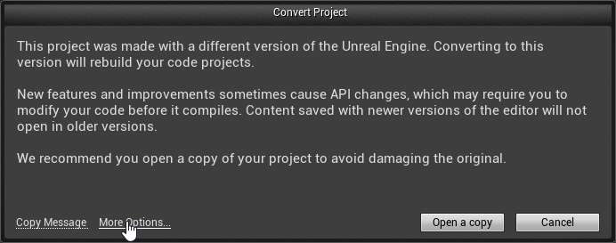
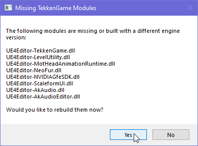

Acquire the TekkenGame project from the [Github repository](https://github.com/Modding-Zaibatsu/TekkenGameNative) by downloading the ZIP file or cloning the repo.

Once you have the files extracted or cloned, open Unreal Engine 4 by navigating to `C:/ue4/Engine/Binaries/Win64` and run `UE4Editor.exe`.

Click on Browse and navigate to the project files directory and select TekkenGame.uproject.

The editor will warn you that the project was made with a different version of Unreal Engine. Click on `More Options` and then click on `Skip Conversion`.

A dialog box will appear, click on `Yes`. The Engine will now compile the TekkenGame project, compiling time will depend on your computer's hardware.